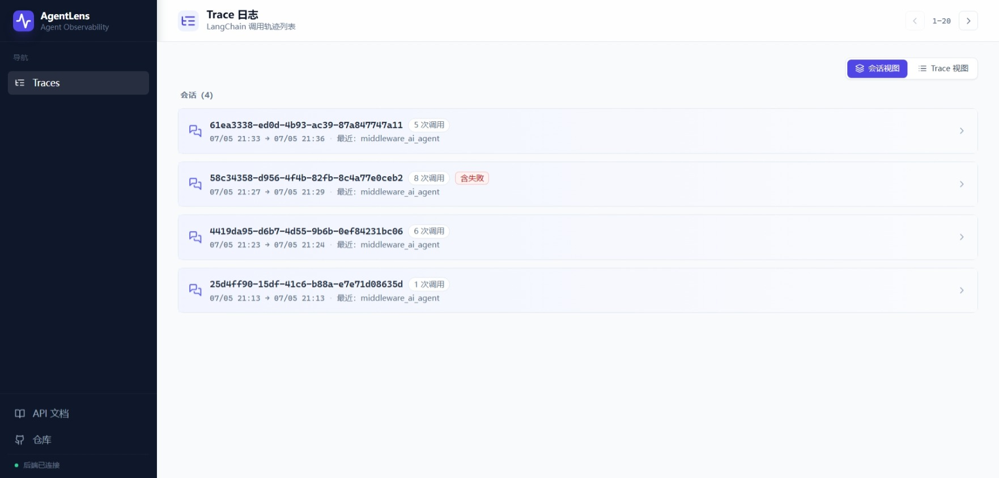
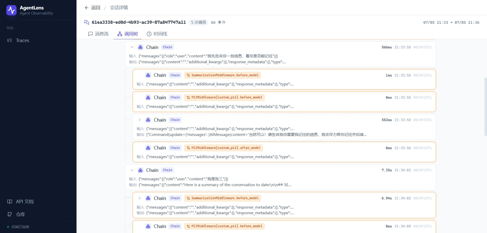
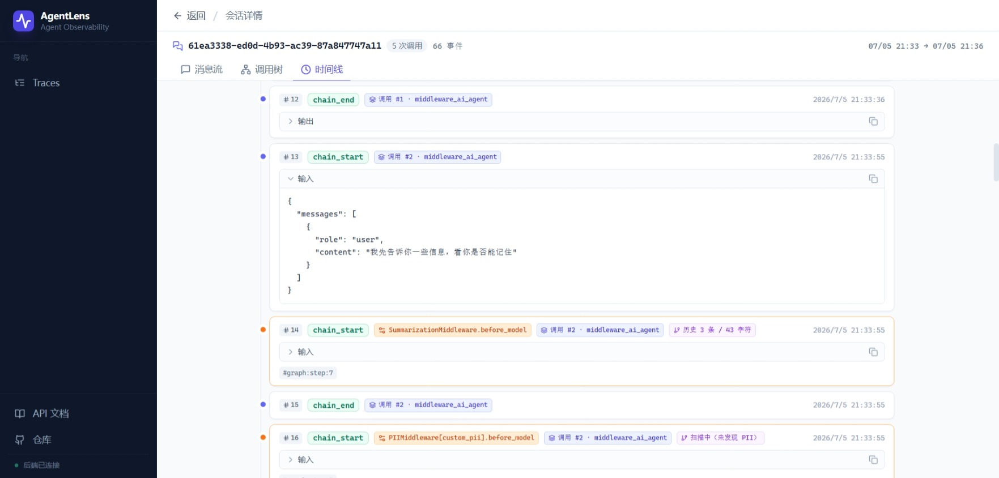
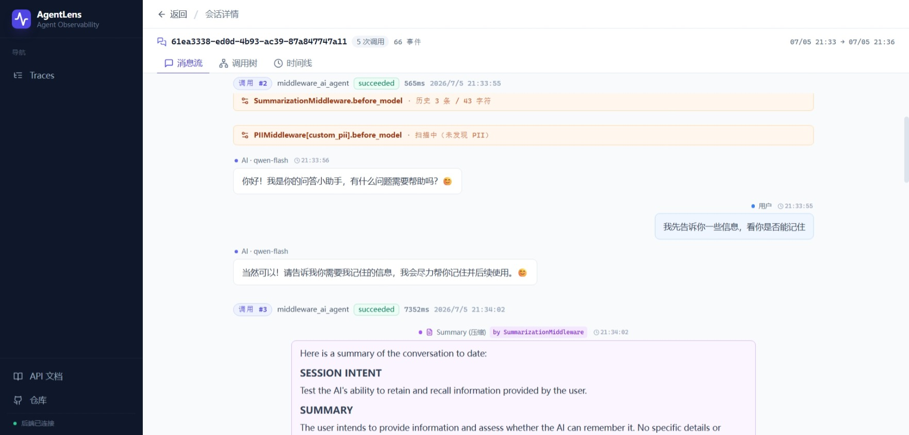
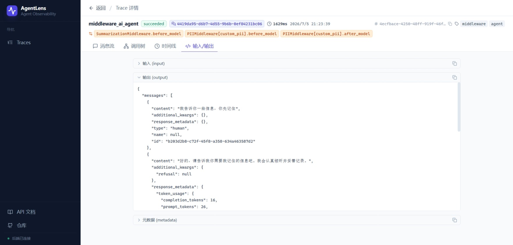

# AgentLens

> **以 agent 视角，观察 LangChain / LangGraph 一次调用的完整轨迹。**

AgentLens 是一个轻量的可观测性平台，专为 LangChain / LangGraph Agent 设计：

- **采集**：通过一个 callback 包在 agent 端零侵入采集所有事件（chain / llm / tool / middleware / retriever / agent_action）
- **存储**：FastAPI 后端 + 可插拔仓储（内存 / 文件 / 可扩展）
- **可视化**：Web 端多视图（列表 / 调用树 / 时间线 / 消息流 / 会话分组）
- **聚焦**：内置 middleware 识别与展示，能区分 `PIIMiddleware` / `SummarizationMiddleware` 等

## 🖼️ 运行截图

<details>
<summary><b>📋 1. Trace 列表（按 thread_id 分组）</b></summary>



</details>

<details>
<summary><b>🌲 2. Trace 详情 · 调用树（middleware 橙色高亮 + 类名徽章）</b></summary>



</details>

<details>
<summary><b>📊 3. Trace 详情 · 时间线（按时间排序 + 来源标号）</b></summary>



</details>

<details>
<summary><b>💬 4. Trace 详情 · 消息流（middleware 边界横幅 + summary 紫色气泡）</b></summary>



</details>

<details>
<summary><b>📦 5. Trace 详情 · IO 详情（JSON 折叠）</b></summary>



</details>

## 仓库结构

```
agentlens/
├── backend/                  # FastAPI 服务（agentlens-server）
│   ├── app/                  # 业务代码
│   ├── tests/                # pytest 测试
│   ├── pyproject.toml
│   └── run.py
├── frontend/                 # React + Vite UI（agentlens-ui）
│   ├── src/
│   └── package.json
├── client/                   # 轻量 Python callback（agentlens-cb）
│   ├── agentlens_cb/         # Python import 路径：agentlens_cb
│   ├── tests/
│   └── pyproject.toml
├── docs/                     # 文档
│   ├── 开发环境启动.md
│   ├── AI-Agent接入说明.md
│   ├── 架构说明.md
│   ├── 部署说明.md
│   └── plans/                # 设计/实施计划
├── Dockerfile.server         # 后端镜像构建
├── Dockerfile.ui             # 前端镜像构建
├── docker-compose.yml        # 一键启动（生产）
├── docker-compose.dev.yml    # 一键启动（开发）
├── nginx.conf                # 前端容器 nginx 配置
├── .env.example              # 环境变量模板
├── .gitignore
├── .dockerignore
└── README.md
```

## 三部分组件

| 组件 | PyPI / pip 名 | Python import | 用途 |
|------|---------------|---------------|------|
| **Server** | `agentlens-server` | `app` | FastAPI 后端，接收并存储 trace |
| **UI** | `agentlens-ui` | — | React 前端，列表 + 多视图详情 |
| **Callback** | `agentlens-cb` | `agentlens_cb` | 嵌入 agent 项目，采集并推送 |

> **命名规则**：
> - pip 包名（如 `agentlens-cb`）用连字符 `-`（PEP 508）
> - Python import 名用下划线 `_`（PEP 8），`pip install agentlens-cb` 后 `import agentlens_cb`

## 快速开始

### 方式 A：本地开发（推荐调试）

见 [docs/开发环境启动.md](docs/开发环境启动.md)

```bash
# 后端
cd backend
python -m venv .venv && .venv\Scripts\activate
pip install -e ".[dev]"
python run.py                          # 双栈监听 :8000

# 前端
cd frontend
npm install && npm run dev             # 启动 :5173

# 客户端包（给 AI Agent 用）
cd client
pip install -e .
```

### 方式 B：Docker Compose 一键启动

```bash
cp .env.example .env                   # 可选：自定义配置
docker compose up -d --build           # 首次构建 + 后台启动

# 访问
#  - 前端：   http://localhost:8080
#  - 后端：   http://localhost:8000
#  - Swagger：http://localhost:8000/docs
```

### 方式 C：开发模式 Docker（live reload）

```bash
docker compose -f docker-compose.yml -f docker-compose.dev.yml up
# 包含 Vite HMR（端口 5173）+ uvicorn --reload（端口 8000）
```

## AI Agent 接入

见 [docs/AI-Agent接入说明.md](docs/AI-Agent接入说明.md)

```bash
pip install agentlens-cb
```

```python
from agentlens_cb import TraceCallbackHandler
handler = TraceCallbackHandler(endpoint="http://localhost:8000/api/v1/traces")
result = agent.invoke(
    {"messages": [{"role": "user", "content": "..."}]},
    config={"callbacks": [handler], "configurable": {"thread_id": "session-1"}},
)
```

## 技术栈

- **Backend**：Python 3.11+ / FastAPI / Pydantic v2 / Uvicorn
- **Frontend**：React 18 / Vite / TypeScript / TailwindCSS / TanStack Query
- **Client**：Python 3.11+ / httpx / langchain-core
- **兼容**：LangChain v1.3.11+ / LangGraph（v0.2+）

## 核心特性

- 🧭 **多视图详情**：调用树（缩进）/ 时间线（序列）/ 消息流（业务）/ IO（JSON）
- 🔗 **会话分组**：相同 `thread_id` 的多次调用自动合并展示
- 🟧 **Middleware 聚焦**：内置 PII / Summarization 等中间件识别，橙色高亮 + 行为摘要
- 🛠️ **可插拔存储**：默认内存（开发）/ 文件（轻量持久化），可扩展数据库
- 🪶 **零侵入接入**：callback 包仅依赖 langchain-core + httpx，无强制 SDK 依赖
- 🐳 **Docker 一键部署**：多阶段镜像 + healthcheck + 数据卷持久化

## 文档

- [docs/开发环境启动.md](docs/开发环境启动.md) — 本地开发
- [docs/AI-Agent接入说明.md](docs/AI-Agent接入说明.md) — 嵌入 AI Agent
- [docs/架构说明.md](docs/架构说明.md) — 整体架构、数据流
- [docs/部署说明.md](docs/部署说明.md) — Docker / 部署
- [docs/plans/](docs/plans/) — 历史实施计划

## License

MIT
